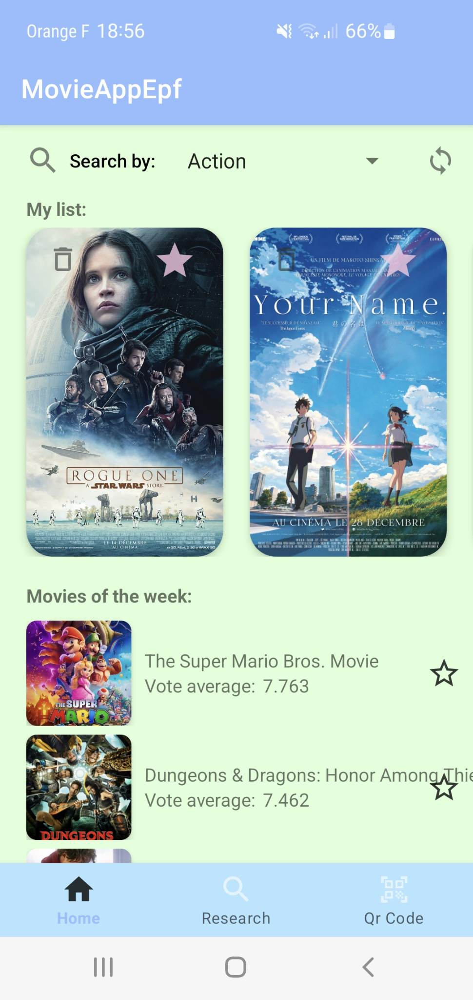
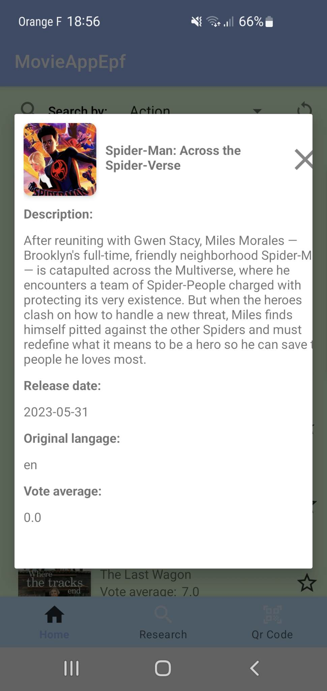
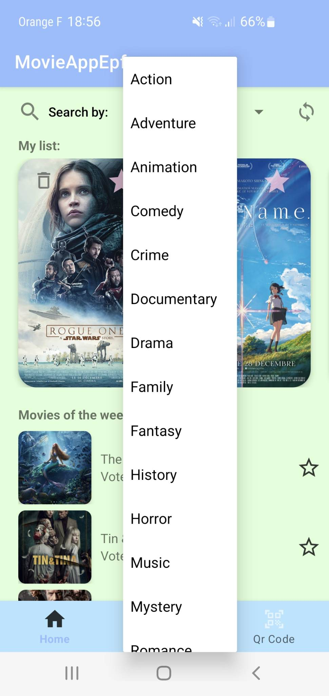
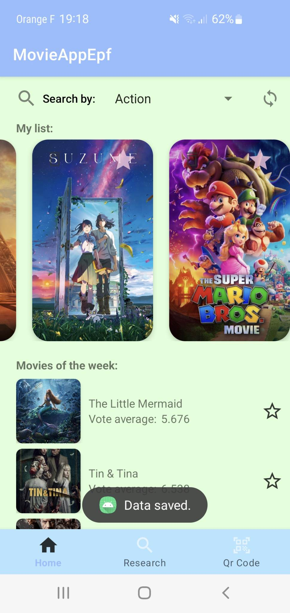
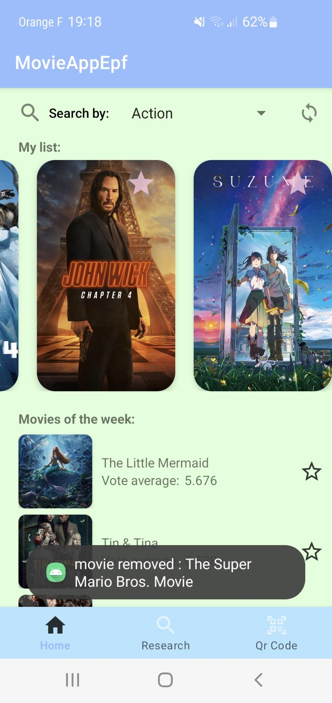

# MovieAppEPF

4th year academic project in Kotlin with Android Studio

## Project Explanation
This is an Android mobile application developed in Kotlin that allows users to search for movies, view movie details, get recommendations based on selected movies, scan QR codes containing movie identifiers, and bookmark favorite movies. The application uses The Movie Database (TMDb) API for accessing movie data

## Features

Search: Users can search for movies by entering a text string. The search result displays a list of movies matching the query.

Movie Details: Users can view detailed information about a specific movie, including its title, release date, overview, and ratings.

Recommendations: The application provides a list of recommended movies based on the movie selected by the user.

QR Code Scanner: Users can scan QR codes that contain movie identifiers. Upon scanning, the app fetches and displays the details of the corresponding movie.

Favorites: Users can mark certain movies as favorites and easily access them later.

## API
The application relies on the following RESTful API for retrieving movie data:

API Base URL: https://developers.themoviedb.org/3
API Documentation: Getting Started with TMDb API

## Getting started
To build and run this application, you need the following : Android Studio.

Clone the repository from GitHub:

`git clone https://github.com/theogenix/MovieAppEPF.git`

Open the project in Android Studio.

Build and run the application on an Android emulator or physical device.

## Additional Features
Category-based Movie Search: Users can now search for movies based on specific categories such as Romance, Animation, Action, and more. This feature allows users to filter the movie results and find movies that belong to their preferred genre or category.

Weekly Movie Recommendations: The application now provides a curated list of recommended movies every week. These recommendations are based on various factors such as user ratings, popularity, and genre preferences. Users can discover new movies and stay updated with the latest releases.

Save Favorite Movie List: Users can now save their favorite movies even after exiting the application. The list of favorite movies will be stored and can be accessed whenever the user returns to the app. This feature allows users to maintain a personalized collection of their preferred movies.

Remove Movies from Favorite List: Users have the option to remove movies from their favorite list. If a movie is no longer a favorite, users can easily remove it from the list to keep their collection up to date with their current preferences.

